# Azure Kubernetes Service (AKS)

This repository showcases the deployment of a single-tier application using Azure Kubernetes Service (AKS).

## Complete Workflow

This workflow diagram outlines an automated CI/CD process for deploying containerized applications to Azure Kubernetes Service (AKS). It demonstrates the seamless integration of version control, continuous integration, containerization, and scalable deployment.

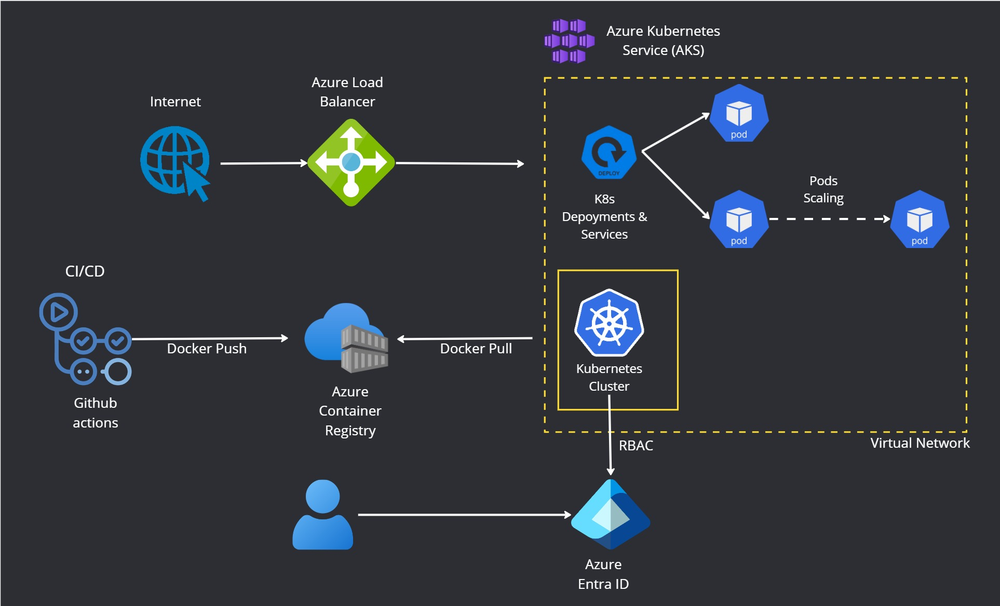

### Workflow Descriptions

**1. Development Stage**:
Developers commit code changes to the GitHub repository, initiating the automated pipeline.

**2. Continuous Integration & Containerization**:
Upon code push, GitHub Actions triggers a build process that creates a Docker image. The image is then securely pushed to Azure Container Registry (ACR) for deployment.

**3. Infrastructure Deployment**:
Terraform scripts provision the Azure infrastructure, including Kubernetes clusters, ensuring an automated, repeatable, and scalable setup.

**4. Kubernetes Deployment**:
The Kubernetes cluster fetches the Docker image from ACR and deploys it as pods, creating scalable and resilient microservices.

**5. Load Balancing & Traffic Management**:
Traffic is managed through an Azure Load Balancer, distributing requests evenly across pods, ensuring high availability and reliability. The external IP is exposed for seamless access.

## Step-by-Step Guide

### 1. Run Terraform Scripts for Creating Azure Resources

To initialize the Terraform deployment, run:

```sh
terraform init
```

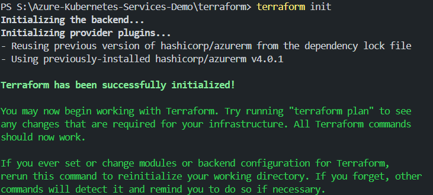

To validate the Terraform deployment, run:

```sh
terraform validate
```

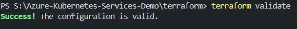

To plan the Terraform deployment, run:

```sh
terraform plan
```

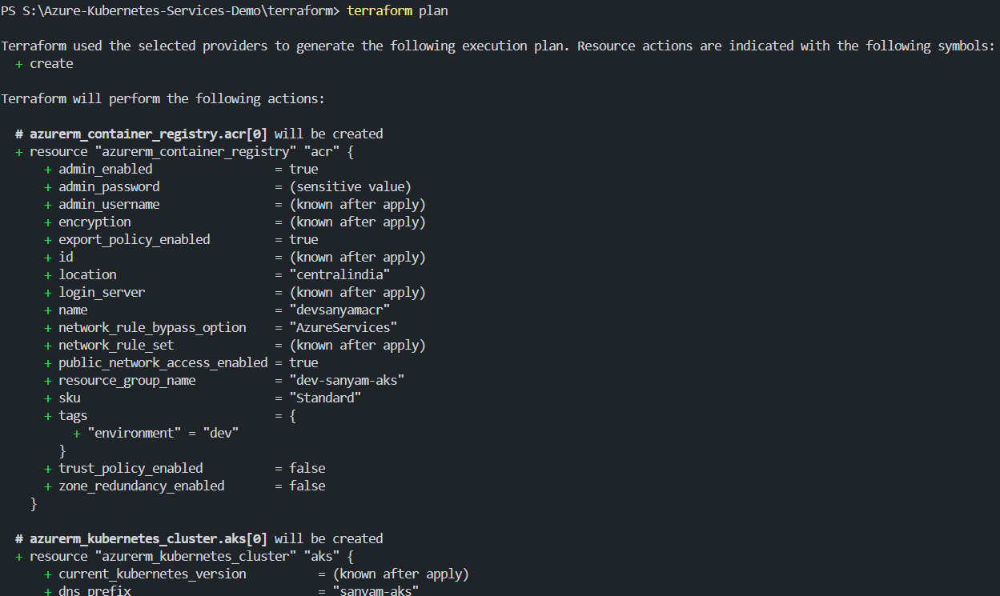

To apply the Terraform deployment, run:

```sh
terraform apply
```

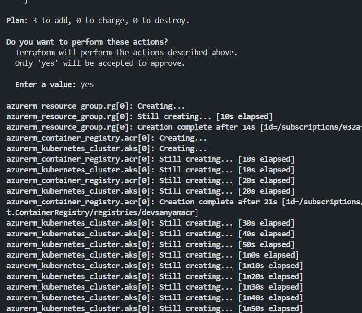

#### 1.1 Verify the Azure Resources

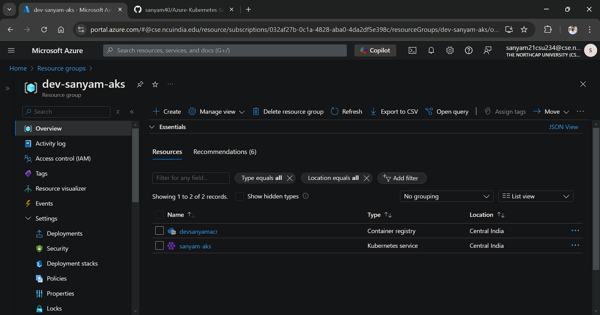

### 2. Configure Azure Container Registry (ACR) Credentials

To authenticate GitHub Actions Workflow with Azure Container Registry:

#### 2.1 Copy ACR Credentials from Azure Portal

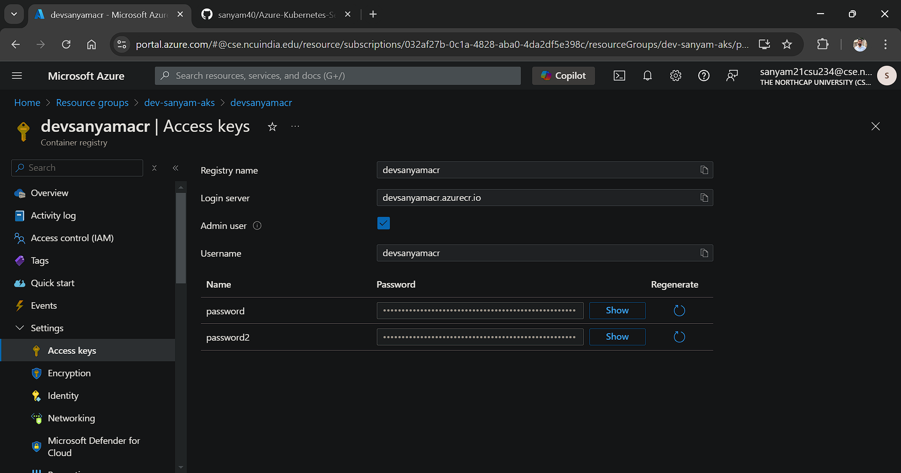

#### 2.2 Add Azure Credentials to GitHub Secrets

Navigate to your GitHub repository > Settings > Secrets > New repository secret

Add the following secrets:

- `DEFAULT_REGISTRY_SERVER`
- `DEFAULT_REGISTRY_USERNAME`
- `DEFAULT_REGISTRY_PASSWORD`

### 3. Make A Release to Run the Workflow for Pushing the Docker Image to ACR

Navigate to the GitHub repository > Releases > Draft a new release

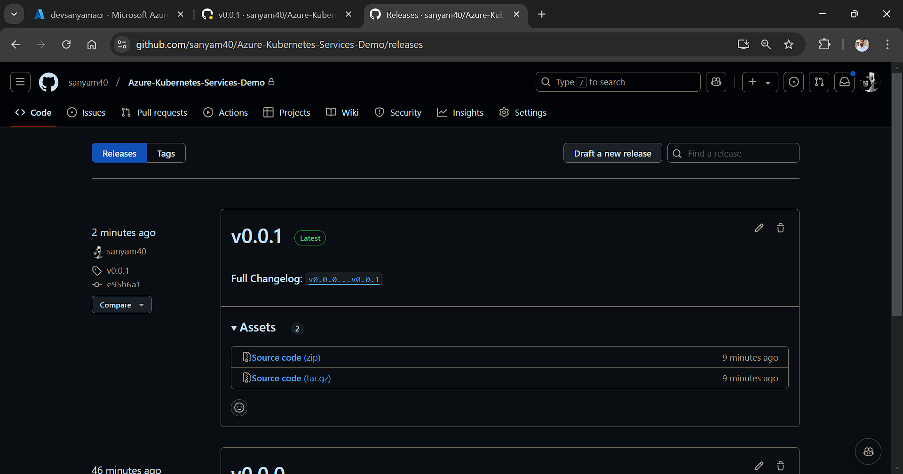

### 4. Monitor the GitHub Actions Workflow

Navigate to the GitHub repository > Actions > Deploy to ACR

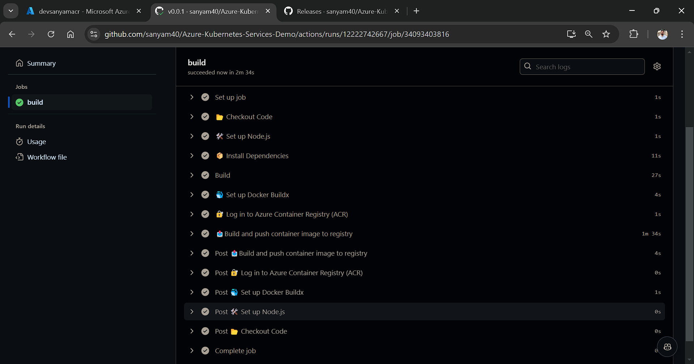

### 5. Set the Kubernetes Context

Configure the `kubectl` context to use an Azure Kubernetes Service (AKS) cluster:

```bash
az aks get-credentials --resource-group <resource-group-name> --name <aks-cluster-name>
```

Example:

```bash
az aks get-credentials --resource-group delete-me --name aks-demo
```

#### 5.1 Check Current Context

Verify the current context being used by `kubectl`:

```bash
kubectl config current-context
```

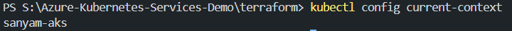

### 6. Create Docker Registry Secret

Create a Docker registry secret to pull images from a private repository:

```bash
kubectl create secret docker-registry regcred --docker-server=<server> --docker-username=<username> --docker-password=<password>
```

### 7. Run Helm Chart to Deploy the Application on AKS

Run the following commands to deploy the application to AKS:

```bash
helm install <release-name> <chart-name>
```

Example:

```bash
helm install demo-aks-helm ./k8s-manifests```

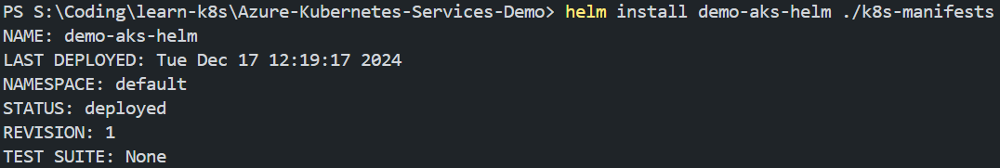

### 8. Verify the Deployment

Check the deployment status and verify the pods:

```bash
kubectl get all
```

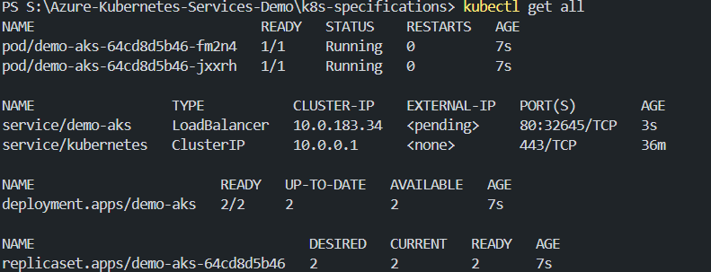

Wait for the external IP to be assigned to the service.

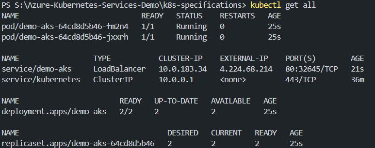

### 9. Access the Application

Access the application after a few minutes using the external IP:

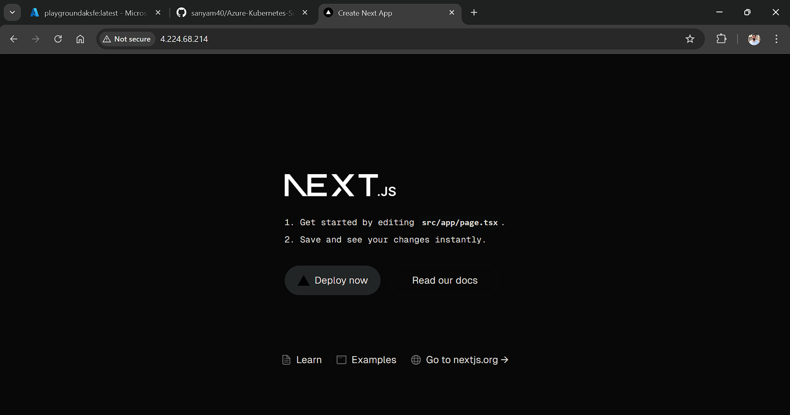

### 10 . Terraform Destroy (To Clean Up Resources)

To clean up the Azure resources created by Terraform, run:

```sh
terraform destroy
```
